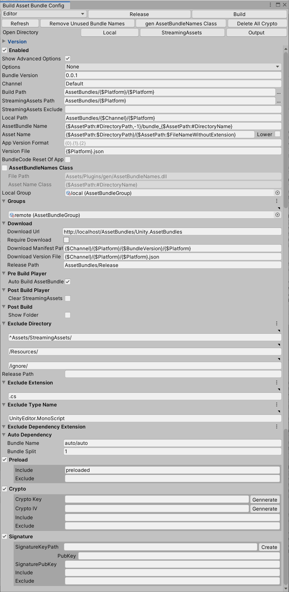
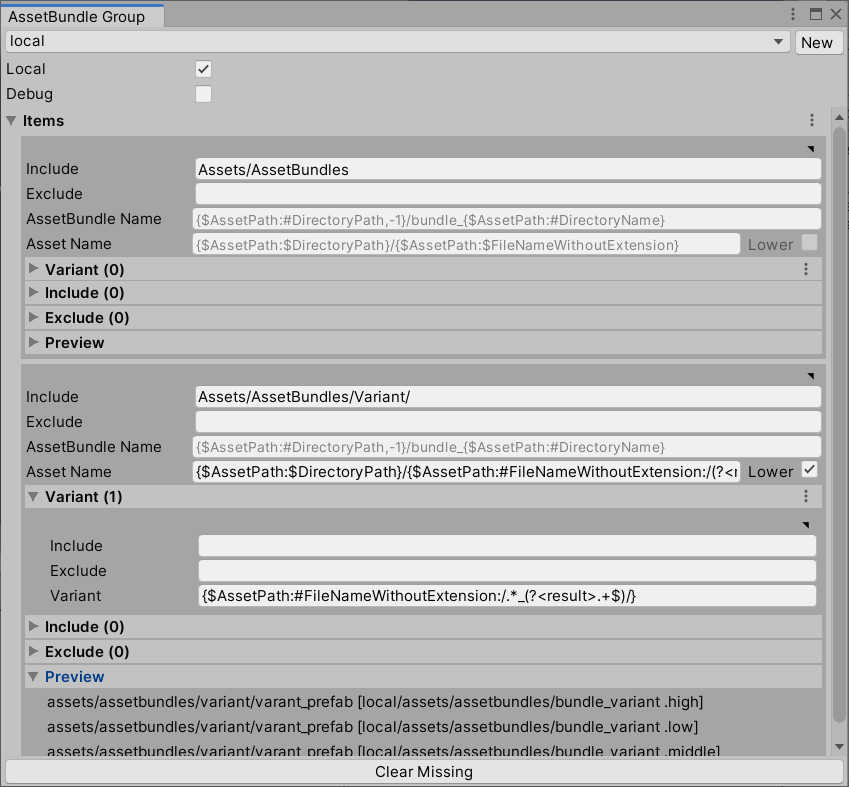

# Unity.AssetBundles

资源打包工具


## manifest.json

   ```
"unity.extensions": "https://github.com/liuwenjiexx/Unity.Extensions.git",
"unity.guiextensions": "https://github.com/liuwenjiexx/Unity.GuiExtensions.git",
"system.stringformat": "https://github.com/liuwenjiexx/System.StringFormat.git",
"unity.localization": "https://github.com/liuwenjiexx/Unity.Localization.git?path=/Assets/Plugins/Unity.Localization",
"unity.assetbundles": "https://github.com/liuwenjiexx/Unity.AssetBundles.git?path=/Assets/Plugins/Unity.AssetBundles",
   ```

Unity 2019.4 支持 git URL


## 预览








## 快速使用

1. `Assets/Example/Src` 测试资源的目录

4. `AssetBundles/Windows` 测试输出目录

5. `Assets/Example/AssetBundlesExample.cs` 使用样例

   


## [详细介绍](Assets/Plugins/Unity.AssetBundles/README.md)

